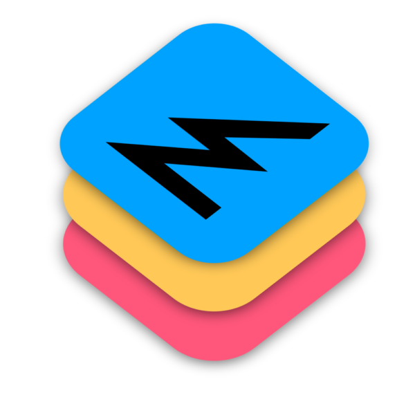

# MetalTools

[](https://swift.org/platforms/)
[](https://swift.org)

<p align="left">
    
</p>

## Description

MetalTools provides a convenient, Swifty way of working with Metal. This library is heavily used in computer vision startups [ZERO10](https://zero10.ar) and [Prisma](https://prisma-ai.com).

## Usage

Please see [the package's documentation](https://swiftpackageindex.com/computer-graphics-tools/metal-tools/documentation/metaltools)
for the detailed usage instructions.

### MTLContext

`MTLContext` is a central component of the MetalTools framework, designed to streamline Metal-based operations. It encapsulates an `MTLDevice` and an `MTLCommandQueue`, providing a unified interface for common Metal tasks.

```swift
import MetalTools

do {
    let context = try MTLContext()
    // Use the context for further operations
} catch {
    print("Failed to create MTLContext: \(error)")
}
```

### Dispatch command buffers in both sync/async manner

See how you can group encodings with Swift closures.

```swift
self.context.scheduleAndWait { buffer in
    buffer.compute { encoder in
      // compute command encoding logic
    }

    buffer.blit { encoder in
      // blit command encoding logic
    }
}
```

### Set resources to Command Encoder

```swift
encoder.setTextures(source, destination)
encoder.setValue(affineTransform, at: 0)
```

### Easily create textures from CGImage

```swift
let texture = try context.texture(
    from: cgImage,
    usage: [.shaderRead, .shaderWrite]
)
```

### Serialize and deserialize MTLTexture

```swift
let encoder = JSONEncoder()
let data = try encoder.encode(texture.codable())

let decoder = JSONDecoder()
let decodableTexture = try decoder.decode(MTLTextureCodableBox.self, from: data)
let decodedTexture = try decodableTexture.texture(device: self.context.device)
```

### Load a compute pipeline state for a function that sits in a framework

```swift
let library = context.library(for: Foo.self)
let computePipelineState = try lib.computePipelineState(function: "brightness")
```

### Allocate buffer by value type

```swift
let buffer = context.buffer(
    for: InstanceUniforms.self,
    count: 99,
    options: .storageModeShared
)
```

### Setup blending mode in render passes

```swift
let renderPipelineDescriptor = MTLRenderPipelineDescriptor()
renderPipelineDescriptor.colorAttachments[0].setup(blending: .alpha)
```

### Other things

- [Ready-to-use compute kernels](Sources/MetalComputeTools/Kernels)
- [Simple geometry renderers](Sources/MetalRenderingTools/Renderers)
- Create multi-sample render target pairs
- Create depth buffers
- Create depth / stencil states
- and more!

## License

MetalTools is licensed under [MIT license](LICENSE).
